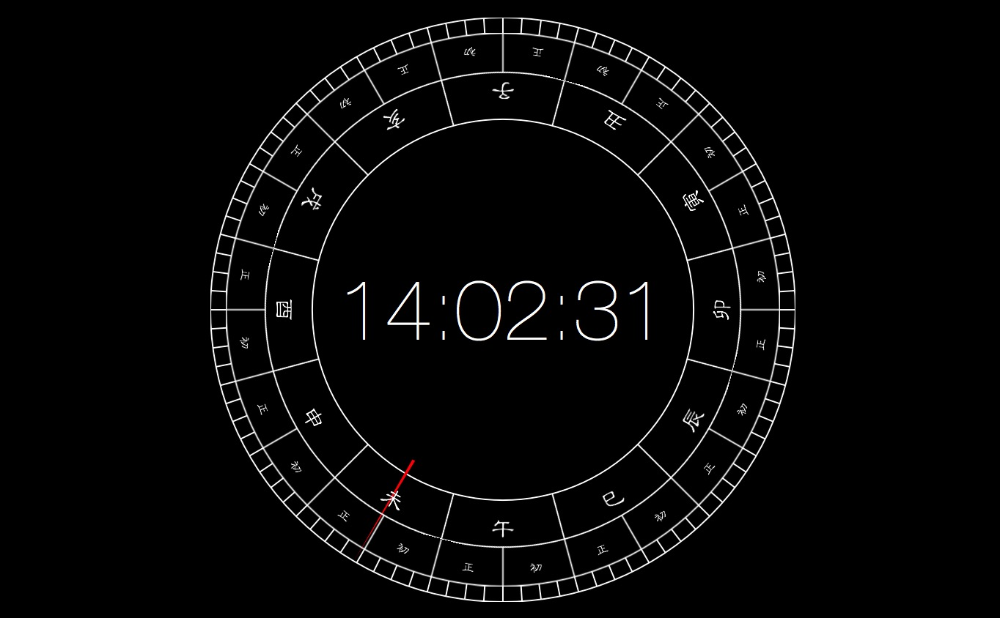

# Sundial

**Mac 日晷屏幕保护程序，Screen Saver, Sundial.saver**

## Usage
1. Build scheme sundial
2. Double click Sundial.saver

Or

1. Download [Sundial.saver.zip](https://github.com/wangweicheng7/Sundial/releases/download/1.0.3/Sundial.saver.zip)
2. Unzip Sundial.saver.zip
3. Double click Sundial.saver

## E.g.

